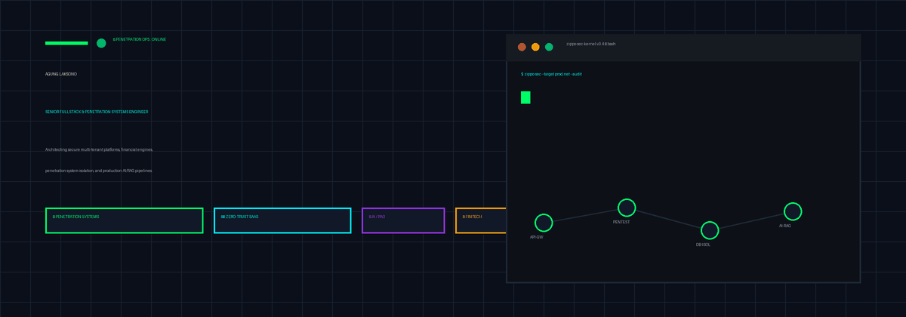
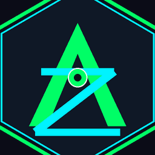

<div align="center">
  
</div>

## Building systems that survive production & penetration audits

I’m **Agung Laksono**, a Senior Fullstack Engineer & Penetration Systems Lead from North Sumatra, Indonesia, with **7+ years** of experience shipping resilient production software across fintech, legal technology, cybersecurity operations, logistics, healthcare, and multi-tenant SaaS.

My work sits at the intersection of product thinking, penetration system security, and high-scale architecture: Zero-Trust APIs, tenant-aware isolation, financial engines, AI-assisted products, deployment automation, and robust systems engineered to withstand vulnerabilities. I’ve improved backend processing performance by up to **40%** through query optimization, execution-plan analysis, and API restructuring.

- Currently engineering fintech & cooperative commerce workflows at **KSP Nasari**
- Specialized in **Penetration Systems, Zero-Trust API Architecture, and System Isolation**
- Building with **TypeScript, React, Node.js, Python, PostgreSQL, and Docker**
- Exploring **agentic AI, RAG, local-first assistants, and security automation**
- Experienced with **KYC, onboarding, approvals, portfolio, watchlist, P&L, and market-data products**
- Based in **North Sumatra, Indonesia**

## Engineering toolkit

| Area | Stack |
| --- | --- |
| **Security & Pentest** | Zero-Trust Architecture, Penetration System Audits, API Security, Tenant Isolation, RBAC, JWT, Audit Logging |
| **Frontend** | React, Next.js, Remix, React Router v7+, TypeScript, Vite, Tailwind CSS, SSR |
| **Backend** | Node.js, NestJS, Hono, Bun, Express, Python, FastAPI, REST, GraphQL, gRPC |
| **Data** | PostgreSQL, MongoDB, Redis, Prisma ORM, Drizzle ORM, Qdrant, SQL optimization |
| **AI & OCR** | LLM integration, agentic workflows, RAG, Ollama, Qwen, PaddleOCR, Tesseract, OpenCV |
| **Architecture** | Multi-tenant SaaS, RBAC, API architecture, audit logging, secure tenant isolation |
| **Delivery** | Docker, Docker Compose, GitHub Actions, CI/CD, Nginx, VPS/cloud deployment |
| **AI-assisted workflow** | Claude Code, Codex, Gemini CLI |

## Selected systems

### Stock Market Portfolio & Trading Dashboard

A fintech prototype for watchlists, portfolio positions, transaction history, market-data views, price charts, and realized/unrealized P&L. Built with Remix, React Router v7+, TypeScript, Node.js, PostgreSQL, Tailwind CSS, and Chart.js/Recharts.

### CrisisOps AI — Multi-Agent Incident Response

An AI-assisted incident platform where six specialized agents collaborate across log investigation, infrastructure analysis, customer impact, communications, decisions, and postmortems. Built with TypeScript, Hono, Bun, Drizzle ORM, PostgreSQL, Docker, and React.

### KTP OCR Registration Autofill

A production OCR pipeline for Indonesian identity cards, extracting NIK, name, address, and occupation with confidence and review indicators. Built with Python, FastAPI, PaddleOCR, Tesseract, OpenCV, Hono, Bun, and Docker.

### Zippo AI Personal Assistant

A local-first assistant with conversational history, vector memory, document ingestion, semantic retrieval, and RAG. Built with Python, FastAPI, Ollama, Qwen, PostgreSQL, Qdrant, and Docker.

### Multi-Tenant Law Firm Management System

A secure enterprise platform featuring tenant isolation, RBAC, document workflows, reusable modules, and production deployment practices using Next.js, React, Node.js, PostgreSQL, and Docker.

### Logistics Tracking Platform

A real-time operations platform whose backend and database access were re-architected to improve processing performance by approximately **40%**.

## How I approach engineering

```text
Understand the domain → model the boundaries → secure the workflow
→ measure the bottleneck → automate delivery → keep the system operable
```

I value maintainable contracts, practical security, observable deployments, and technical decisions that support the product—not architecture for architecture’s sake.

## Connect

- GitHub: [@agungzippo](https://github.com/agungzippo)
- Email: [atungzippo@gmail.com](mailto:atungzippo@gmail.com)
- LinkedIn: [Agung Laksono](https://www.linkedin.com/in/agung-laksono-53a833115/)
- Portfolio: [agungzippo.tech](https://agungzippo.tech)

---

<div align="center">
  
  <br />
  <sub>Fintech · Penetration Systems · AI Product Engineering · Resilient Operations</sub>
</div>
